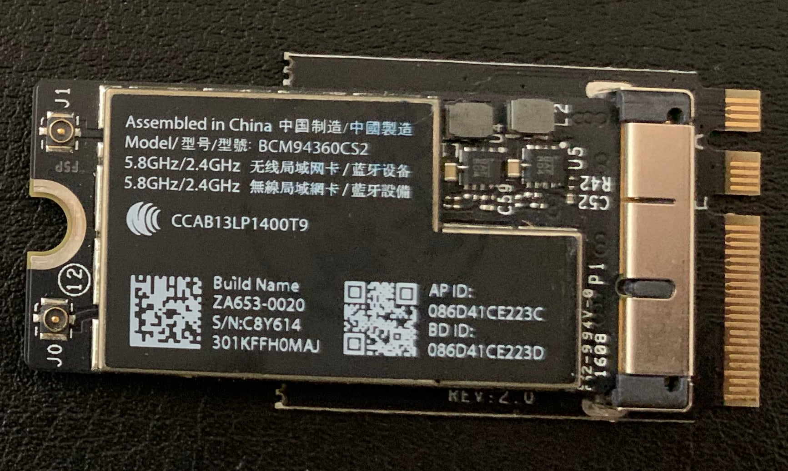
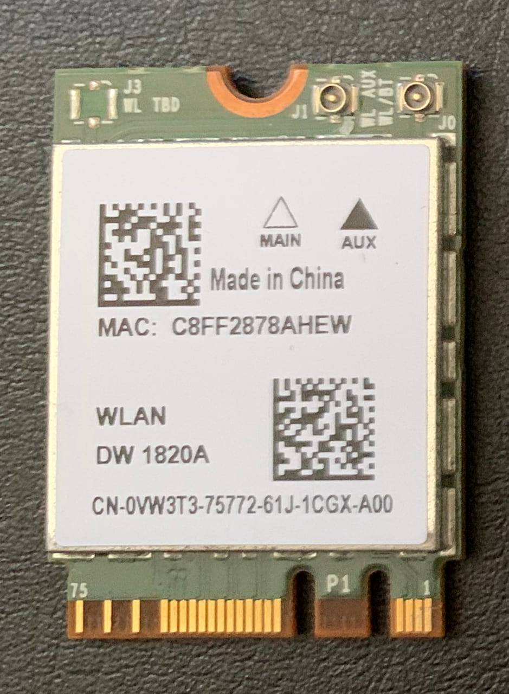

# HP EliteBook 850 G5 Hackintosh
Opencore Hackintosh for HP EliteBook 850 G5. I'm using always latest BIOS version, OpenCore, additional kexts and macOS.
For my specific laptop configuration almost everything works except SmartCard reader, that I even don't use.
I'm still working on improvement and clean ups.

## Massive overhaul
Hack is now based almost on pure OpenCore patches and hack. I followed [this guide](https://github.com/dortania/OpenCore-Desktop-Guide/blob/master/clover-conversion/Clover-config.md) and [this guide](https://dortania.github.io/Getting-Started-With-ACPI/). Thank to [@Joaotcs](https://github.com/Joaotcs) that pushed me to do it. There left only few thing from RehabMan repo.
There are still some things that could be rewriten and I will do it when I figure out hot to do it.

Huge thanks to [Acidanthera team](https://github.com/acidanthera) for [OpenCore](https://github.com/acidanthera/OpenCorePkg).
Extra credit goes to [@usr-sse2](https://github.com/usr-sse2) for [help with battery](https://github.com/acidanthera/bugtracker/issues/892).
Also specialy thanks to [@RehabMan](https://github.com/RehabMan) because it's was based on [his work](https://github.com/RehabMan/HP-ProBook-4x30s-DSDT-Patch/tree/i2c).

### My configuration

- Intel Core i5-8350U
- Intel UHD 620
- 32 GB DDR4 (2x 16GB Kingston KVR24S17D8)
- Full HD non-touch display (1920x1080)
	- UVC Camera VendorID_1480 ProductID_945 (Foxlink/Cheng Uei Precision Industry Co., Ltd.)
	- No ambient light sensor
- Corsair Force MP510 960GB M.2 SSD NVMe
- Fenvi BCM94360NG M.2 card
- [i-tec Thunderbolt 3 Dual DP Video Adapter](https://i-tec.cz/en/produkt/tb3dual4kdp-2/) (laptod display + two external HP E233 displays)

### Currently not working + solutions

- Bundled Intel Wifi card (8265NGW)
    
  - For out of the box support you need [Airport](https://dortania.github.io/Wireless-Buyers-Guide/Airport.html) BCM94360CS2 with M.2 adapter (cca. 20 USD) that I had, but it fits to laptop case very hard. And I had waves on my keyboard :).
    
  - Better, but more expensive (cca. 50 USD) solution is [Fenvi BCM94360NG M.2 card](https://www.aliexpress.com/item/32464748097.html?spm=a2g0s.9042311.0.0.6a744c4d7jS1RQ) that is based on Airport card and fits into laptop perfectly. The best thing - you also don't need any kexts for Wifi nor bluetooth and works out of the box.
  - For cheaper (12 - 15 USD) solution you can use DW1820A. There is new [ASPM fix](https://osxlatitude.com/forums/topic/11322-broadcom-bcm4350-cards-under-high-sierramojavecatalina/), that solves freezing issues.
    
- Trackpoint with buttons (that point in center of G, H, B keys), but we have great touchpad with all gertures.
- Hibernation (I think it can be done somehow, but I don't need it and I use FileVault2 full disk encryption).
- DRM (Apple TV+, Netflix in Safari), but there is workaround use different browser ([Vivaldi](https://vivaldi.com) for me). There is also web version of [Apple TV+](https://tv.apple.com) that works from browser.
- Dual display port output on HP Ultraslim dock 2013 and other docking stations. Both DP works as one because macOS [doesn't support DisplayPort MST (Multi Stream or daisy-chaining)](https://medium.com/@sebvance/everything-you-need-to-know-about-macbook-pros-and-their-lack-of-displayport-mst-multi-stream-98ce33d64af4). It's not issue with Hackintosh but macOS itself.
  If you want output to more than 1 external display, you need simple USB-C -> HDMI/DP adapter or [TB3 -> Dual Display Port dongle with DisplayLink 6950](https://i-tec.cz/en/produkt/tb3dual4kdp-2/).

## BIOS settings

This is my BIOS settings. I'm currently on latest BIOS 01.11.01 Rev.A. With it works even USB-C/Thunderbolt port with hotplug.
You can set Video memory size to 64MB minimum.

